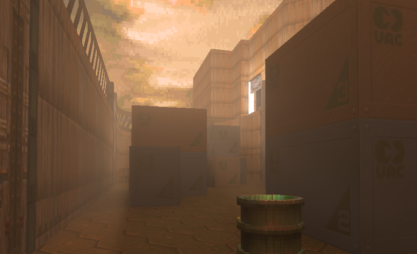

# TuinDOOM RT

TuinDOOM RT is a Windows launcher and customized GZDoom ray-tracing build designed to make ray-traced lighting practical with Doom, Doom II, and many custom WADs—not only the original Doom II maps.



## Download

The ready-to-install Windows build is available from the [TuinDOOM RT 1.4.7.10 release](https://github.com/tuin-boop/TuinDOOMRT/releases/tag/v1.4.7.10).

You must supply a legally owned Doom IWAD. Commercial IWADs are not included.

## Highlights

- Doom, Doom II, Final Doom, and PWAD support through per-WAD ray-tracing scene isolation.
- Automatic Steam and common GOG IWAD discovery, including TNT and Plutonia.
- Warm outdoor sunlight with randomized direction and intensity.
- Optional realistic Episode 1 lighting for stock E1M1 through E1M8, with a brown Martian landscape and six synchronized visible-sun positions.
- Optional realistic Episode 2 lighting for stock E2M1 through E2M8, with a cratered Deimos panorama and a hidden red directional light sourced from the Hell rift.
- Optional realistic Episode 3 lighting for stock E3M1 through E3M8, with an Inferno wasteland and a hidden orange-red light sourced from the burning horizon.
- Ray-traced flashlight with atmospheric dust.
- Automatic luminous ceiling fixtures.
- Bundled NashGore and an RT voxel compatibility package.
- Selectable ray-traced blood fluids and wall decals.
- Ordered external-mod loading for WAD, PK3, and PK7 files.
- Saved launcher profiles, startup information, and randomized intro artwork.
- Optional colored lighting from original and custom skies.

## Default controls

- `N`: cycle the outdoor or authored light direction and intensity.
- `F`: toggle the flashlight.

When **Realistic E1 Lights** is enabled, `N` cycles six curated visible-sun positions while moving the directional light with it.
When **Realistic E2 Lights** is enabled, `N` cycles six high-angle red rift-light directions without drawing a visible sun.
When **Realistic E3 Lights** is enabled, `N` cycles six low orange-red horizon-light directions without drawing a visible sun.

## Known limitations

- Experimental enhanced-liquid shaders are not enabled in this stable build.
- External gameplay and weapon mods can replace projectile actors and therefore bypass some RT projectile lighting or effects.
- Compatibility varies between WADs; the launcher includes a stock Doom II scene toggle where appropriate.
- An RTX/Vulkan-capable GPU and compatible drivers are required.

## Building from source

### Engine

1. Install the normal GZDoom Windows build dependencies.
2. Set `RTGL1_SDK_PATH` to a compatible RTGL1 SDK checkout/build.
3. Run `auto-setup-windows.cmd`, then build the generated Visual Studio solution.
4. Copy the required RTGL1 runtime libraries beside the resulting `gzdoom.exe`.

The customized engine code is under `src/`, with TuinDOOM RT compatibility assets and scripts under `wadsrc/`, `compat/`, and `tools/`.

### Launcher

Run:

```bat
launcher\TuinDoomRT\build-launcher.cmd
```

The launcher is compiled with the .NET Framework x64 C# compiler included with Windows/.NET Framework.

### Installer

Install Inno Setup, then run:

```bat
installer\build-installer.cmd
```

The installer packages the prepared engine and launcher but never includes commercial Doom IWADs.

## Source lineage and credits

TuinDOOM RT is based on [GZDoom](https://github.com/ZDoom/gzdoom) and [GZDoom: Ray Traced](https://github.com/sultim-t/gzdoom-rt). Engine-derived source is distributed under the GNU GPL v3. Bundled third-party mod assets retain their own licenses and attribution; see [Third-party components](docs/THIRD-PARTY.md).

## License

See [LICENSE](LICENSE). Third-party packages retain their respective licenses.
